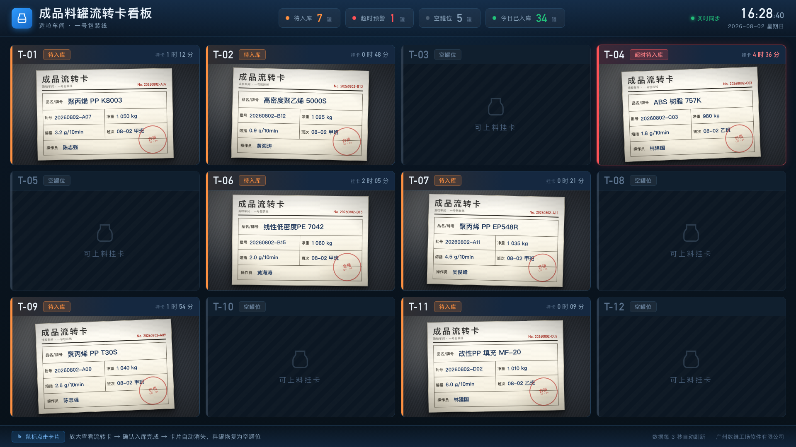
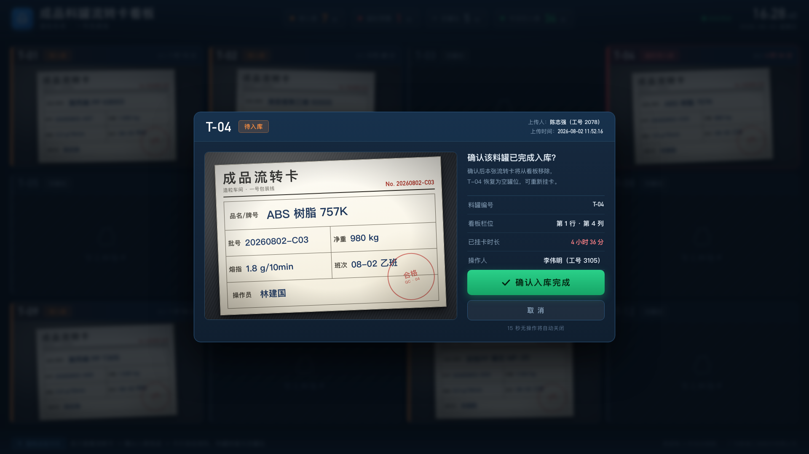
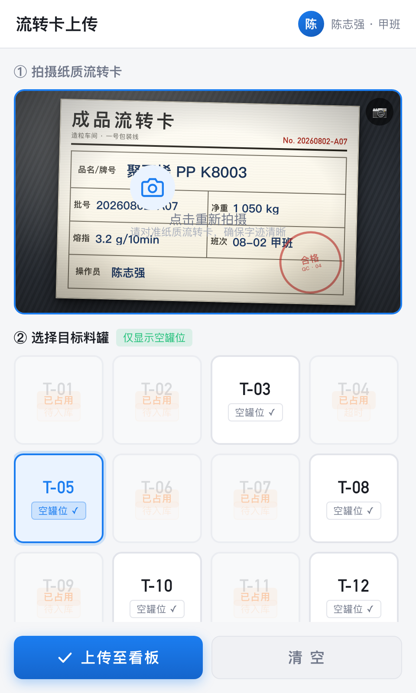
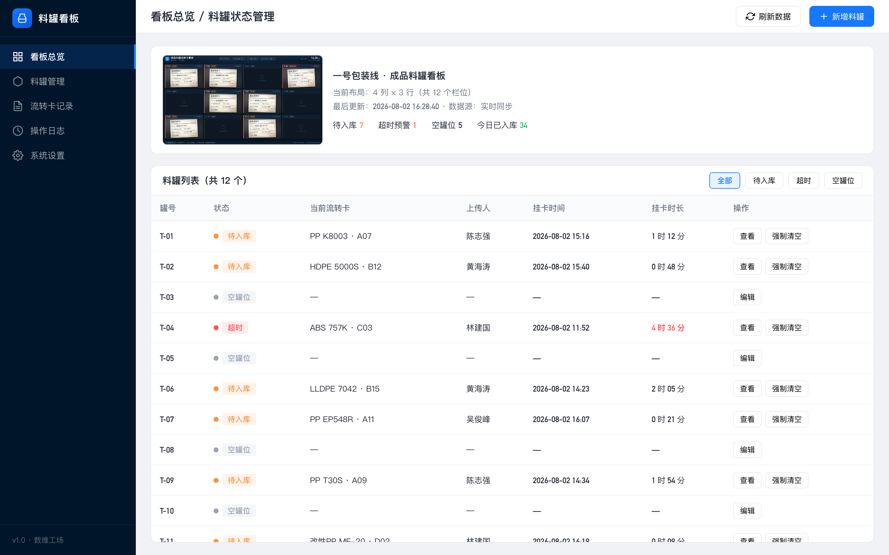

# 看板设计方案

# 电子看板设计方案（运通条码）

**方案状态**：设计定稿 · 待客户确认

补充场景：料做好后机器自动存入罐体，此前由人员将纸质流转卡放置到现场看板，入库时操作员对着纸质卡操作。本方案将其电子化，照片即为唯一信息载体，不额外录入字段。

## 一、项目背景与目标

### 1\.1 客户场景

- **行业**：塑料颗粒造粒车间

- **现状**：料做好后机器自动存入罐体 → 操作员将纸质流转卡放置到现场看板 → 入库时对着纸质卡操作

- **痛点**：纸质卡片易丢失、污损、难以追溯；现场看板信息更新不及时；无法远程监控

- **目标**：用 PDA 拍照上传替代纸质流转卡，电子看板实时展示，操作员鼠标点击确认入库

### 1\.2 核心需求

|\#|需求|说明|
|---|---|---|
|1|**PDA 拍照上传**|操作员用 PDA 对着纸质流转卡拍照，选择对应料罐后上传至看板|
|2|**看板展示**|电视大屏按料罐栏位展示流转卡照片，每个罐位一张卡|
|3|**可配置栏位**|支持后台配置料罐数量和看板布局（默认 4 列 × 3 行 = 12 个）|
|4|**入库确认**|操作员在看板上点击卡片 → 弹出二次确认 → 确认后卡片消失、罐恢复为空|
|5|**过滤逻辑**|PDA 选罐时只显示「空罐位」，已挂卡的罐不可选（防止一罐挂多张卡）|
|6|**后台管理**|PC 后台可查看所有罐状态、调整图片位置、修改罐状态、强制清空|

## 二、系统架构

### 2\.1 三端架构

系统由三端组成，彼此通过网络实时联动：

- **电视看板端**：车间现场大屏，实时展示各料罐的流转卡照片与状态；

- **PDA 端**：操作员手持设备，拍照上传流转卡并选择对应料罐；

- **后台管理端**：PC 浏览器，用于料罐基础信息管理、记录查询与异常监控。

数据由服务端统一存储与同步：PDA 上传后看板自动刷新，入库确认后状态实时回写，三端所见一致。

## 三、界面效果图

以下四张效果图基于上述需求与现场场景绘制，可直接反映最终使用界面。所有纸卡照片均为仿真绘制（无「AI 生成」字样），用于演示看板展示效果。

### 3\.1 电视看板大屏（1920 × 1080）

深色工业风设计，4 列 × 3 行共 12 个料罐栏位。顶部为实时统计与时钟，底部为操作指引。三种状态用颜色区分：橙色边框为正常待入库，红色边框加发光为超时预警（默认超过 4 小时），灰暗栏位为空罐位。



### 3\.2 确认入库弹窗

点击任意待入库卡片 → 全屏遮罩弹出：左侧大图预览（可看清纸卡手写内容），右侧信息面板 \+ 绿色「确认入库完成」按钮，15 秒无操作自动关闭，避免误触与卡片丢失。确认后卡片消失、料罐恢复为空罐位。



### 3\.3 PDA 拍照上传端（480 × 800 竖屏）

竖屏操作界面：① 拍照区调用 PDA 相机；② 选罐网格仅显示**空罐位**（蓝色高亮可选），已挂卡的料罐灰显 \+ 「已占用」浮层遮挡，从源头杜绝一罐多卡。必须同时有照片 \+ 选中空罐才能提交，网络异常时本地暂存待恢复。



### 3\.4 PC 后台管理端（1440 × 900）

左侧导航 \+ 看板实时缩略图 \+ 料罐列表表格。模块含：看板总览、料罐管理、流转卡记录、操作日志、系统设置。料罐列表支持查看大图、强制清空（异常处理）、编辑基础信息。



## 四、各端详细设计

### 4\.1 电视看板大屏（1920 × 1080）

**布局结构**

```text
┌──────────────────────────────────────────────────────┐
│  [Logo] 成品料罐流转卡看板    [统计] [时钟]           │  ← Header 88px
├────────┬────────┬────────┬────────┤
│ T-01   │ T-02   │ T-03   │ T-04   │
│ 待入库  │ 待入库  │ 空罐位  │ 超时!  │
│ [照片] │ [照片] │   ○    │ [照片] │
├────────┼────────┼────────┼────────┤
│ T-05   │ T-06   │ T-07   │ T-08   │
│ ...    │ ...    │ ...    │ ...    │
├────────┼────────┼────────┼────────┤
│ T-09   │ T-10   │ T-11   │ T-12   │
│ ...    │ ...    │ ...    │ ...    │
├────────┴────────┴────────┴────────┤
│  【提示】点击卡片 → 确认入库 → 卡片消失               │  ← Footer 52px
└──────────────────────────────────────────────────────┘
```

**核心功能**：

- **实时刷新**：看板自动更新最新数据，无需手动刷新

- **状态颜色**：橙色「待入库」正常等待；红色发光「超时待入库」超 4 小时；灰暗「可上料挂卡」空闲

- **二次确认弹窗**：点击卡片 → 全屏遮罩 → 左侧大图 \+ 右侧信息 \+ 绿色确认按钮 \+ 15 秒无操作自动关闭

- **顶部统计**：待入库数 / 超时数 / 空罐位数 / 今日已入库数

- **底部提示**：操作指引 \+ 版权信息

### 4\.2 PDA 拍照上传端（480 × 800 竖屏）

**页面流程**

```text
┌────────────────────┐
│ 流转卡上传    [用户]│  ← Header
├────────────────────┤
│ ① 拍摄纸质流转卡    │
│ ┌────────────────┐ │
│ │  [ 拍好的照片 ] │ │  ← 相机区域
│ │  (纸卡预览)     │ │
│ └────────────────┘ │
│  点击重新拍摄       │
├────────────────────┤
│ ② 选择目标料罐      │
│ ┌────┬────┬────┬────┐
│ │T-01│T-02│T-03│T-04│  ← 4×3 网格
│ │已占│已占│空  │已占│     空罐蓝色高亮
│ ├────┼────┼────┼────┤     已占用灰色+半透明
│ │T-05│T-06│... │... │     + "已占用"标签
│ └────┴────┴────┴────┘
├────────────────────┤
│ [ 上传至看板 ][ 清空 ]│  ← 提交栏
└────────────────────┘
```

**核心功能**：

- **拍照**：调用 PDA 相机 API，支持重新拍摄

- **选罐过滤**：只展示 status=idle 的罐；已占用罐灰显 \+ 「已占用」浮层遮挡

- **提交校验**：必须同时有照片 \+ 选中空罐才能提交

- **离线缓存**：网络异常时本地暂存，恢复后自动上传

### 4\.3 PC 后台管理端（1440 × 900）

**模块划分**

|模块|功能|
|---|---|
|**看板总览**|实时看板缩略图 \+ 统计概览 \+ 料罐列表|
|**料罐管理**|新增/编辑/删除料罐、拖拽调整位置、配置行列数|
|**流转卡记录**|历史卡片查询、原图下载、按日期/批号筛选|
|**操作日志**|所有操作的审计追踪（谁、什么时间、做了什么）|
|**系统设置**|超时阈值、刷新间隔、通知规则|

**料罐列表核心操作**：

- **查看**：打开该罐当前流转卡的大图及详情

- **强制清空**：管理员手动清除某罐的 pending 卡（用于异常处理）

- **编辑**：修改罐号、名称、位置等基础信息

## 五、关键技术细节

为现场稳定运行，系统在以下方面做了重点保障：

- **图片清晰又轻量**：上传时自动优化，看板显示清晰缩略图，点击可看原图；

- **断网不丢卡**：PDA 弱网或断网时本地暂存，恢复网络后自动补传；

- **防重复挂卡**：同一料罐同时只允许挂一张待入库卡，从源头避免「一罐多卡」；

- **操作留痕**：入库确认记录操作人与时间，便于追溯；

- **权限与安全**：PDA 需登录、后台按角色区分权限，接口做访问控制。

## 六、实施计划建议

|阶段|内容|工期预估|
|---|---|---|
|P0|服务端 \+ 看板主界面 \+ PDA 拍照上传|5\-7 天|
|P1|二次确认弹窗 \+ 后台管理 \+ 操作日志|3\-4 天|
|P2|超时预警 \+ 离线缓存 \+ 异常处理|2\-3 天|
|P3|现场部署 \+ 联调测试 \+ 培训|3\-7 天|

## 七、交付物清单

本次交付物为以下 4 张界面效果图，覆盖电视看板、PDA 与后台管理三端，可直接用于客户评审与现场演示：

|序号|文件|说明|
|---|---|---|
|1|01\-电视看板大屏\.png|看板主界面效果图（1920×1080）|
|2|02\-看板确认入库弹窗\.png|二次确认弹窗效果图|
|3|03\-PDA拍照上传端\.png|PDA 操作端效果图（480×800）|
|4|04\-后台管理端\.png|PC 后台管理效果图（1440×900）|

